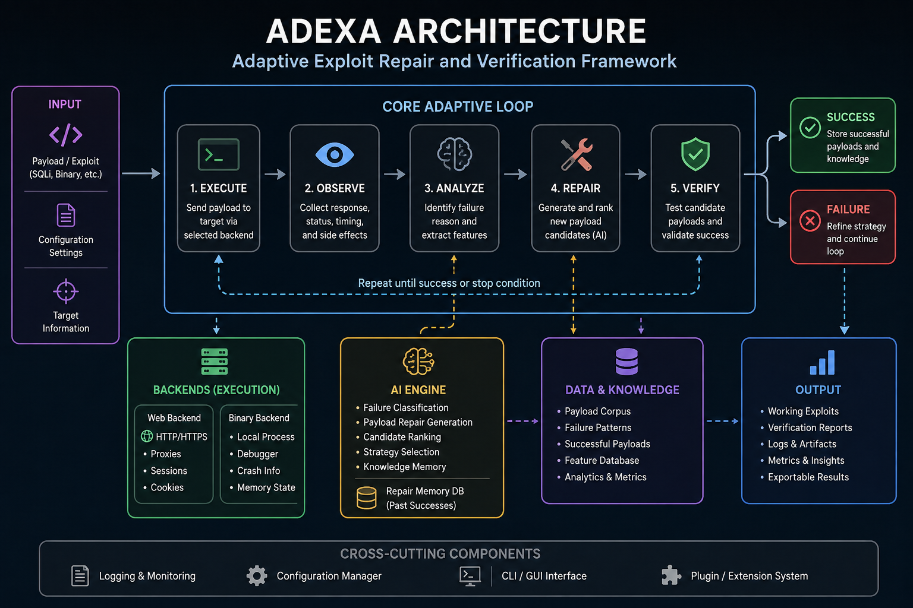
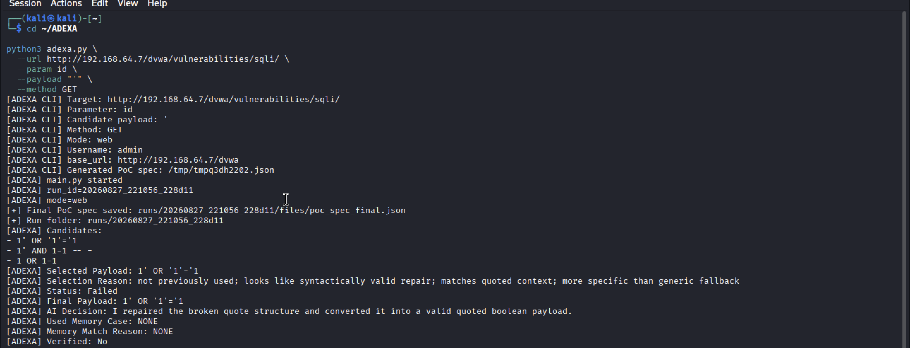

# ADEXA

### Adaptive Exploit Repair and Verification Framework

**ADEXA** is a cybersecurity research framework that analyzes failed security-testing payloads, generates repaired candidates, and verifies whether the repaired payload succeeds against an authorized test environment.

Instead of simply stopping when a payload fails, ADEXA attempts to understand the failure and adapt the payload through an iterative process:

**Execute → Observe → Analyze → Repair → Verify → Learn**

> **Status:** Research prototype — active development

---

## The Problem

Automated security testing tools can identify and test vulnerabilities using predefined payloads. However, when a payload fails because of syntax, context, session state, or another execution issue, further adaptation may require manual intervention from a penetration tester.

ADEXA investigates whether part of this process can be automated.

The objective is not simply to generate more payloads, but to build a system capable of:

1. executing a security-testing payload,
2. observing what happened,
3. identifying why the attempt failed,
4. generating an appropriate repair,
5. testing the repaired candidate,
6. verifying whether it actually worked,
7. and retaining useful results for future decisions.

---

## Architecture

ADEXA is built around an adaptive execution loop connecting the execution backend, analysis and AI components, verification logic, and repair memory.

<p align="center">
  
</p>

<p align="center">
  <em>ADEXA adaptive exploit repair and verification architecture.</em>
</p>

The main components are:

- **Core Adaptive Loop** — coordinates execution, observation, analysis, repair, and verification.
- **Execution Backends** — interact with controlled web and experimental binary targets.
- **AI Engine** — assists with failure analysis, candidate generation, scoring, and repair decisions.
- **Verification** — determines whether a repaired candidate actually succeeds.
- **Repair Memory** — stores useful previous repairs that can support later decisions.
- **Run Storage & Logging** — records iterations and artifacts for reproducibility and analysis.

---

## Demo

ADEXA analyzes a failed payload, selects a repair strategy, generates a new candidate, and verifies whether the repaired payload successfully executes.

<p align="center">
  
</p>

<p align="center">
  <em>Example of ADEXA repairing and verifying a payload in a controlled DVWA environment.</em>
</p>

## How ADEXA Works

```text
                 ┌───────────────┐
                 │ Input Payload │
                 └───────┬───────┘
                         │
                         ▼
                    ┌─────────┐
                    │ Execute │
                    └────┬────┘
                         │
                         ▼
                    ┌─────────┐
                    │ Observe │
                    └────┬────┘
                         │
                         ▼
                    ┌─────────┐
                    │ Analyze │
                    └────┬────┘
                         │
                         ▼
                    ┌────────┐
                    │ Repair │
                    └────┬───┘
                         │
                         ▼
                    ┌────────┐
                    │ Verify │
                    └───┬────┘
                        │
                 ┌──────┴──────┐
                 │             │
              SUCCESS        FAILURE
                 │             │
                 ▼             └──────► Repeat
           Store Result
```

ADEXA therefore treats exploit testing as an **adaptive loop** rather than a single attempt.

---

## Current Focus: SQL Injection

The current web implementation focuses primarily on **SQL injection repair and verification** in controlled environments such as DVWA.

ADEXA can work with malformed or unsuccessful SQLi payloads and attempt to produce valid candidates while maintaining the intended testing behavior.

Current work includes:

- malformed payload analysis,
- quote and syntax repair,
- Boolean-based payload adaptation,
- time-based payload adaptation,
- candidate generation and ranking,
- automated execution,
- success verification,
- previous-repair reuse,
- and iteration logging.

The SQLi implementation is intended as ADEXA's **first specialist capability**, rather than the final scope of the project.

---

## AI-Assisted Repair

ADEXA combines deterministic security-testing logic with AI-assisted decision making.

Conceptually:

```text
Broken Payload
      │
      ▼
Failure / Execution Context
      │
      ▼
Failure Analysis
      │
      ▼
Repair Strategy
      │
      ▼
Candidate Payloads
      │
      ▼
Verification
```

The AI layer can assist with:

- interpreting failure information,
- selecting repair strategies,
- generating candidate repairs,
- ranking candidates,
- and using previous successful cases as context.

Verification remains important because a syntactically plausible payload is not automatically a successful payload.

---

## Repair Memory

ADEXA includes a repair-memory mechanism for retaining useful information from previous successful attempts.

Instead of treating every failure as completely new, previous repairs can contribute to future candidate selection.

This creates the basic cycle:

```text
Attempt
   ↓
Repair
   ↓
Verify
   ↓
Success
   ↓
Store
   ↓
Reuse when relevant
```

This component is part of ADEXA's longer-term goal of becoming more adaptive as it encounters additional testing cases.

---

## Project Structure

```text
ADEXA/
├── ai_engine/
│   ├── crash_ai.py
│   ├── exploit_rewriter.py
│   ├── exploit_scorer.py
│   ├── poc_ai.py
│   └── repair_memory.py
│
├── backends/
│   ├── binary_backend.py
│   └── web_backend.py
│
├── core/
│   ├── loop_controller.py
│   ├── models.py
│   └── run_store.py
│
├── debugger/
│   ├── crash_parser.py
│   ├── gdb_runner.py
│   └── offset_finder.py
│
├── exploit_tests/
├── gui/
├── poc_specs/
├── utils/
├── web_engine/
│
├── adexa.py
├── main.py
├── benchmark_adexa.py
└── README.md
```

### Main directories

| Directory | Purpose |
|---|---|
| `ai_engine/` | AI-assisted analysis, repair generation, scoring, and memory |
| `backends/` | Web and experimental binary execution logic |
| `core/` | Adaptive loop, internal models, and run storage |
| `debugger/` | Crash parsing, GDB execution, and offset analysis |
| `exploit_tests/` | Controlled local testing material |
| `poc_specs/` | Proof-of-concept specifications |
| `web_engine/` | Web testing and vulnerability-analysis components |
| `gui/` | Experimental graphical interface |

---

## Experimental Binary Support

Alongside the current SQLi work, the repository contains experimental components for binary exploit analysis.

These components explore:

- debugger integration,
- crash parsing,
- offset discovery,
- exploit rewriting,
- and repaired exploit execution.

This remains an experimental part of ADEXA and is not currently the primary development focus.

---

## Evaluation

ADEXA is evaluated by looking beyond whether it can merely generate a candidate.

Important measurements include:

- repair success rate,
- verification success,
- payload-family preservation,
- number of repair attempts,
- use of previous repair memory,
- candidate diversity,
- and performance on previously unseen cases.

A major development objective is to compare the adaptive system against simpler baselines on held-out SQLi cases.

---

## Roadmap

ADEXA is currently transitioning from a university research prototype toward a broader security-testing framework.

Planned development includes:

- [ ] Expand and improve the SQLi repair dataset
- [ ] Evaluate repairs on completely unseen SQLi cases
- [ ] Compare trained models against baseline ADEXA behavior
- [ ] Improve repair strategy classification
- [ ] Increase candidate diversity
- [ ] Add additional vulnerability classes
- [ ] Improve scanner and security-tool integration
- [ ] Strengthen automated exploit verification
- [ ] Add remediation re-testing
- [ ] Improve the user interface and reporting layer

Potential future vulnerability classes include XSS, command injection, and SSRF.

---

## Long-Term Vision

The long-term goal of ADEXA is broader than automatically repairing SQL injection strings.

The project explores a workflow where a security finding can move through:

```text
Security Finding
       ↓
Exploit Attempt
       ↓
Failure Analysis
       ↓
Adaptive Repair
       ↓
Exploit Verification
       ↓
Evidence
       ↓
Remediation
       ↓
Security Re-Test
```

The aim is to investigate how adaptive reasoning and automated verification can reduce repetitive manual work during authorized security testing.

---

## Responsible Use

ADEXA is intended exclusively for:

- cybersecurity research,
- educational environments,
- controlled laboratories,
- CTF-style environments,
- and systems where the tester has explicit authorization.

**Do not use ADEXA against systems without permission.**

Users are responsible for ensuring that their testing activities comply with applicable laws, policies, and authorization requirements.

---

## License

This project is licensed under the terms provided in the [`LICENSE`](LICENSE) file.

---

## Author

**David-Axel Kacou**

Cybersecurity & Digital Forensics

---

*ADEXA is an experimental research project and should not be considered a production-ready penetration-testing platform.*
